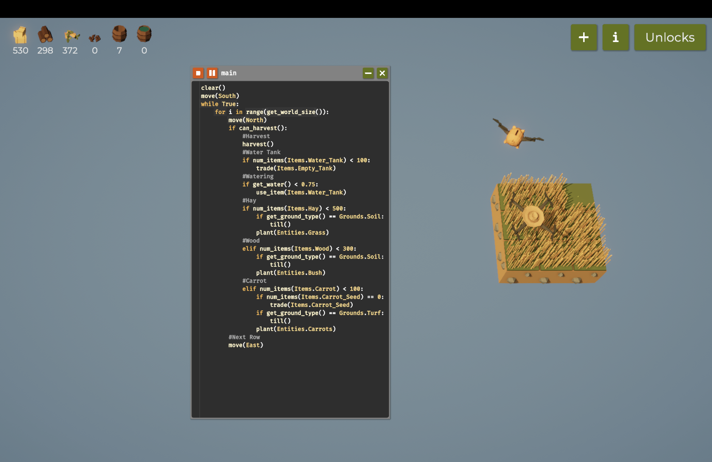

# Programming the Farming Drone (Report)
## Introduction
In this farming simulation game, players control a drone to automate tasks using Python-inspired code, aiming to streamline farm productivity. Resources gathered unlock new tech and upgrades, adding depth to the gameplay. Starting with coding basics, the game gradually introduces more complex challenges, catering to both beginners and experienced coders. The ultimate objective is to build a self-sustaining, efficient farm while enhancing programming skills through practical application.

# Table of Contents
- [Code Snippets and Explanation](#code-snippets-and-explanation)
- [Challenges and Learnings](#challenges-and-learnings)
- [References](#references)

# Code-Snippets-and-Explanation

## Step 1: Farming on 1x3 tile

**Code:**

```python
while True:
    plant(Entities.Bush)
    if can_harvest():
        harvest()
        move(North)
    else:
        move(North)
```


**Explanation:**

The code runs in an endless loop, where the drone repeatedly plants a bush and checks if harvesting is possible. If can_harvest() returns True, it triggers the harvest() function to collect the grass, followed by a move to the north. If harvesting isn’t possible (can_harvest() returns False), the drone simply moves north without harvesting. This setup ensures continuous planting and harvesting while allowing the drone to steadily progress northward, keeping it consistently active in managing the farm.


**Demo:**


**Notes**

- Using the code above I was able to get enough hay and wood to expand the tiles.
- These features were unlocked too: senses and operators.


## Step 2: Farming on 3x3 tile

**Code:**

```python
#Reset
clear()
move(South)
#Variables
WaterTank = 100
Hay = 500
Wood = 300
Carrot = 100
#Main Loop
while True:
    for i in range(get_world_size()):
        move(North)
        if can_harvest():
            #Harvest
            harvest()
            #Water Tank
            if num_items(Items.Water_Tank) < WaterTank:
                trade(Items.Empty_Tank)
            #Watering
            if get_water() < 0.75:
                use_item(Items.Water_Tank)
            #Hay
            if num_items(Items.Hay) < Hay:
                if get_ground_type() == Grounds.Soil:
                    till()
                plant(Entities.Grass)
            #Wood
            elif num_items(Items.Wood) < Wood:
                if get_ground_type() == Grounds.Soil:
                    till()
                plant(Entities.Bush)
            #Carrot
            elif num_items(Items.Carrot) < Carrot:
                if num_items(Items.Carrot_Seed) == 0:
                    trade(Items.Carrot_Seed)
                if get_ground_type() == Grounds.Turf:
                    till()
                plant(Entities.Carrots)
    #Next Row
    move(East)
```


**Explanation:**

The code runs in an endless loop, where the drone repeatedly moves through each row of the farm, managing resources and planting crops. It begins by resetting its position and setting inventory limits for water, hay, wood, and carrots.

In each cycle, the drone moves north and checks if harvesting is possible. If can_harvest() returns True, it triggers the harvest() function to collect items, followed by checks to ensure resources are stocked:

* It trades for water tanks if the supply is low, replenishes water if levels are below 75%, and manages planting based on inventory needs.
* If hay is below the set limit, it tills the soil and plants grass.
* If wood is needed, it tills the soil and plants bushes.
* If carrot inventory is low, it trades for seeds, tills turf ground, and plants carrots.

After each row is completed, the drone moves east to the next row, repeating the cycle. This setup ensures continuous planting, harvesting, and resource management, keeping the drone consistently active as it progresses efficiently across the farm.


**Demo:**





**Notes**

- Using the code above I was able to get enough hay and wood to expand the tiles.
- These features were unlocked too: debug, variables and watering.


## Step 3: Farming on 4x4 tile

**Code:**

```python
#Reset
clear()
do_a_flip()
move(South)
#Variables
WaterTankLim = 100
HayLim = 20000
WoodLim = 10000
CarrotLim = 5000
PumpkinLim = 1000
#Main Loop
while True:
    for i in range(get_world_size()):
        move(North)
        x = get_pos_x()
        y = get_pos_y()
        if can_harvest():
            #Harvest
            harvest()
            #Watering
            Watering()
            #Planting
            Planting()
        else:
            if get_ground_type() == Grounds.Soil:
                till()
    #Next Row
    move(East)

def Watering():
    # Water Tank
    if num_items(Items.Water_Tank) < WaterTankLim:
        trade(Items.Empty_Tank, 5)
    # Watering
    if get_water() < 0.75:
        use_item(Items.Water_Tank)

def Planting():
    #Sunflower
    if x == 0 and y == 0:
        if num_items(Items.Sunflower_Seed) == 0:
            trade(Items.Sunflower_Seed, 5)
        if get_ground_type() == Grounds.Turf:
            till()
        plant(Entities.Sunflower)
    #Hay
    elif num_items(Items.Hay) < HayLim:
        if get_ground_type() == Grounds.Soil:
            till()
        plant(Entities.Grass)
    #Wood
    elif num_items(Items.Wood) < WoodLim:
        if (x % 2 == 0 and y % 2 == 1) or (x % 2 == 1 and y % 2 == 0):
            plant(Entities.Tree)
        else:
            if get_ground_type() == Grounds.Soil:
                till()
            plant(Entities.Bush)
    #Carrot
    elif num_items(Items.Carrot) < CarrotLim:
        if num_items(Items.Carrot_Seed) == 0:
            trade(Items.Carrot_Seed, 5)
        if get_ground_type() == Grounds.Turf:
            till()
        plant(Entities.Carrots)
    #Pumpkin
    elif num_items(Items.Pumpkin) < PumpkinLim:
        if num_items(Items.Pumpkin_Seed) == 0:
            trade(Items.Pumpkin_Seed, 5)
        if get_ground_type() == Grounds.Turf:
            till()
        plant(Entities.Pumpkin)
```


**Explanation:**

The code runs in an endless loop, where the drone moves through each row of the farm, managing resources and planting crops. It starts by resetting its position and setting inventory limits for water, hay, wood, carrots, and pumpkins.

In each cycle, the drone moves north and checks if harvesting is possible. If can_harvest() returns True, the harvest() function is called to collect items, followed by checks to keep resources stocked:

* The drone trades for water tanks if supplies are low, replenishes water if levels are below 75%, and manages planting based on inventory needs.
* If hay is below the limit, it tills the soil and plants grass.
* If wood is needed, it plants trees at specific coordinates or tills the soil and plants bushes elsewhere.
* If carrot or pumpkin inventory is low, it trades for seeds, tills turf, and plants carrots or pumpkins.
* At (0,0), it plants sunflowers if seeds are available.

After completing each row, the drone moves east to the next row, repeating the cycle. This ensures continuous planting, harvesting, and resource management, keeping the drone consistently active across the farm.


**Demo:**


**Notes**

- Using the code above I was able to get enough hay, wood, carrots, sunflower and pumpkins to expand the tiles.
- These features were unlocked too: functions and multi-trade.


## Step 4: Farming on 5x5 tile

**Code:**

``` python
#Reset
clear()
do_a_flip()
move(South)
#Variables
WaterTankLim = 100
HayLim = 20000
WoodLim = 10000
CarrotLim = 5000
PumpkinLim = 1000
#Main Loop
while True:
    for i in range(get_world_size()):
        move(North)
        x = get_pos_x()
        y = get_pos_y()
        if can_harvest():
            #Harvest
            harvest()
            #Watering
            Watering()
            #Planting
            Planting()
        else:
            if get_ground_type() == Grounds.Soil:
                till()
    #Next Row
    move(East)

def Watering():
    # Water Tank
    if num_items(Items.Water_Tank) < WaterTankLim:
        trade(Items.Empty_Tank, 5)
    # Watering
    if get_water() < 0.75:
        use_item(Items.Water_Tank)

def Planting():
    #Sunflower
    if x == 0 and y == 0:
        if num_items(Items.Sunflower_Seed) == 0:
            trade(Items.Sunflower_Seed, 5)
        if get_ground_type() == Grounds.Turf:
            till()
        plant(Entities.Sunflower)
    #Hay
    elif num_items(Items.Hay) < HayLim:
        if get_ground_type() == Grounds.Soil:
            till()
        plant(Entities.Grass)
    #Wood
    elif num_items(Items.Wood) < WoodLim:
        if (x % 2 == 0 and y % 2 == 1) or (x % 2 == 1 and y % 2 == 0):
            plant(Entities.Tree)
        else:
            if get_ground_type() == Grounds.Soil:
                till()
            plant(Entities.Bush)
    #Carrot
    elif num_items(Items.Carrot) < CarrotLim:
        if num_items(Items.Carrot_Seed) == 0:
            trade(Items.Carrot_Seed, 5)
        if get_ground_type() == Grounds.Turf:
            till()
        plant(Entities.Carrots)
    #Pumpkin
    elif num_items(Items.Pumpkin) < PumpkinLim:
        if num_items(Items.Pumpkin_Seed) == 0:
            trade(Items.Pumpkin_Seed, 5)
        if get_ground_type() == Grounds.Turf:
            till()
        plant(Entities.Pumpkin)
```


**Explanation:**

The code maintains a uniform approach as the drone progresses through each row. In every cycle, the drone executes the same steps—harvesting if possible, managing resources, and planting according to inventory requirements. This steady routine allows the drone to handle the entire farm in a reliable and systematic way, ensuring that tasks are consistently repeated across all rows.


**Demo:**


**Notes**

- Using the code above I was able to get enough hay, wood, carrots, sunflower and pumpkins to expand the tiles.


## Step 5: Farming on 6x6 tile

**Code:**

``` python
#Reset
clear()
do_a_flip()
move(South)
#Variables
WaterTankLim = 100
HayLim = 20000
WoodLim = 10000
CarrotLim = 5000
PumpkinLim = 1000
#Main Loop
while True:
    for i in range(get_world_size()):
        #Buy Stuff
        if num_items(Items.Sunflower_Seed) < 100:
            trade(Items.Sunflower_Seed, get_world_size())
        if num_items(Items.Carrot_Seed) < 100:
            trade(Items.Carrot_Seed, get_world_size())
        if num_items(Items.Pumpkin_Seed) < 100:
            trade(Items.Pumpkin_Seed, get_world_size())
        #Move
        move(North)
        x = get_pos_x()
        y = get_pos_y()
        if can_harvest():
            #Harvest
            harvest()
            #Watering
            Watering()
            #Planting
            Planting()
        else:
            if get_ground_type() == Grounds.Soil:
                till()
    #Next Row
    move(East)

def Watering():
    # Water Tank
    if num_items(Items.Water_Tank) < WaterTankLim:
        trade(Items.Empty_Tank, 5)
    # Watering
    if get_water() < 0.8:
        use_item(Items.Water_Tank)

def Planting():
    #Sunflower
    if x == 0 and y == 0:
        if num_items(Items.Sunflower_Seed) == 0:
            trade(Items.Sunflower_Seed, 5)
        if get_ground_type() == Grounds.Turf:
            till()
        plant(Entities.Sunflower)
    #Hay
    elif num_items(Items.Hay) < HayLim:
        if get_ground_type() == Grounds.Soil:
            till()
        plant(Entities.Grass)
    #Wood
    elif num_items(Items.Wood) < WoodLim:
        if (x % 2 == 0 and y % 2 == 1) or (x % 2 == 1 and y % 2 == 0):
            plant(Entities.Tree)
        else:
            if get_ground_type() == Grounds.Soil:
                till()
            plant(Entities.Bush)
    #Carrot
    elif num_items(Items.Carrot) < CarrotLim:
        if num_items(Items.Carrot_Seed) == 0:
            trade(Items.Carrot_Seed, 5)
        if get_ground_type() == Grounds.Turf:
            till()
        plant(Entities.Carrots)
    #Pumpkin
    elif num_items(Items.Pumpkin) < PumpkinLim:
        if num_items(Items.Pumpkin_Seed) == 0:
            trade(Items.Pumpkin_Seed, 5)
        if get_ground_type() == Grounds.Turf:
            till()
        plant(Entities.Pumpkin)
```


**Explanation:**

The drone now includes a "Buy Stuff" section at the start of each cycle to manage seed inventory for sunflowers, carrots, and pumpkins. This new section checks if the quantity of each seed type is below 100. If so, the drone uses the trade() function to restock by purchasing an amount of seeds equal to the farm’s world size.

This addition ensures the drone maintains a steady supply of seeds, which supports continuous planting without running out. It integrates smoothly with the main loop, where planting and harvesting actions depend on having sufficient seeds available, thereby enhancing the farm’s productivity and automation by keeping key resources consistently stocked.


**Demo:**


**Notes**

- Using the code above I was able to get enough hay, wood, carrots, sunflower and pumpkins to expand the tiles.
- I unlocked fertilizers.


## Step 6: Farming on 7x7 tile

**Code:**

``` python
#Reset
clear()
do_a_flip()
move(South)
#Variables
WaterTankLim = 100
HayLim = 125000
WoodLim = 75000
CarrotLim = 50000
PumpkinLim = 25000
PowerLim = 5000
#Lists
PedalList = list()
#Main Loop
while True:
    for i in range(get_world_size()):
        #Buy Stuff
        if num_items(Items.Sunflower_Seed) < 100:
            trade(Items.Sunflower_Seed, get_world_size())
        if num_items(Items.Carrot_Seed) < 100:
            trade(Items.Carrot_Seed, get_world_size())
        if num_items(Items.Pumpkin_Seed) < 100:
            trade(Items.Pumpkin_Seed, get_world_size())
        #Move
        move(North)
        x = get_pos_x()
        y = get_pos_y()
        #Harvest Sunflower
        if can_harvest():
            if get_entity_type() == Entities.Sunflower:
                if measure() == max(PedalList):
                    harvest()
                    PedalList.remove(max(PedalList))
            else:
                #Harvest
                harvest()
                #Watering
                Watering()
                #Planting
                Planting()
        else:
            if get_ground_type() == Grounds.Soil:
                till()
    #Next Row
    move(East)

def Watering():
    # Water Tank
    if num_items(Items.Water_Tank) < WaterTankLim:
        trade(Items.Empty_Tank, 5)
    # Watering
    if get_water() < 0.8:
        use_item(Items.Water_Tank)

def Planting():
    #Sunflower
        if num_items(Items.Sunflower_Seed) == 0:
            trade(Items.Sunflower_Seed, 5)
        if get_ground_type() == Grounds.Turf:
            till()
        plant(Entities.Sunflower)
        PedalList.append(measure())
    #Hay
    elif num_items(Items.Hay) < HayLim:
        if get_ground_type() == Grounds.Soil:
            till()
        plant(Entities.Grass)
    #Wood
    elif num_items(Items.Wood) < WoodLim:
        if (x % 2 == 0 and y % 2 == 1) or (x % 2 == 1 and y % 2 == 0):
            plant(Entities.Tree)
        else:
            if get_ground_type() == Grounds.Soil:
                till()
            plant(Entities.Bush)
    #Carrot
    elif num_items(Items.Carrot) < CarrotLim:
        if num_items(Items.Carrot_Seed) == 0:
            trade(Items.Carrot_Seed, 5)
        if get_ground_type() == Grounds.Turf:
            till()
        plant(Entities.Carrots)
    #Pumpkin
    elif num_items(Items.Pumpkin) < PumpkinLim:
        if num_items(Items.Pumpkin_Seed) == 0:
            trade(Items.Pumpkin_Seed, 5)
        if get_ground_type() == Grounds.Turf:
            till()
        plant(Entities.Pumpkin)
```


**Explanation:**

This code uses a list, PedalList, to track sunflower growth stages. When a sunflower is planted, its growth level is added to the list. Upon harvesting, the drone checks if the sunflower has reached its maximum recorded stage in PedalList. If so, it harvests the sunflower and removes the stage from the list, ensuring the drone only harvests fully grown sunflowers, optimizing resource management on the farm.


**Demo:**


**Notes**

- Using the code above I was able to get enough hay, wood, carrots, sunflower and pumpkins to expand the tiles.
- These features were unlocked too: utilities, lists and polyculture.


## Step 7: Farming on 10x10 tile

**Code:**

``` python
#Reset
clear()
do_a_flip()
move(South)
#Variables
WaterTankLim = 100
HayLim = 300000
WoodLim = 200000
CarrotLim = 150000
PumpkinLim = 80000
PowerLim = 1000
#Lists
PedalList = list()
#Main Loop
while True:
    for i in range(get_world_size()):
        #Buy Stuff
        if num_items(Items.Sunflower_Seed) < 100:
            trade(Items.Sunflower_Seed, get_world_size())
        if num_items(Items.Carrot_Seed) < 100:
            trade(Items.Carrot_Seed, get_world_size())
        if num_items(Items.Pumpkin_Seed) < 100:
            trade(Items.Pumpkin_Seed, get_world_size())
        #Move
        move(North)
        x = get_pos_x()
        y = get_pos_y()
        #Harvest Sunflower
        if can_harvest():
            if get_entity_type() == Entities.Sunflower:
                if measure() == max(PedalList):
                    harvest()
                    PedalList.remove(max(PedalList))
            else:
                #Harvest
                harvest()
                #Watering
                Watering()
                #Planting
                Planting()
        else:
            if get_ground_type() == Grounds.Soil:
                till()
    #Next Row
    move(East)

def Watering():
    # Water Tank
    if num_items(Items.Water_Tank) < WaterTankLim:
        trade(Items.Empty_Tank, 5)
    # Watering
    if get_water() < 0.8:
        use_item(Items.Water_Tank)

def Planting():
    #Sunflower
        if num_items(Items.Sunflower_Seed) == 0:
            trade(Items.Sunflower_Seed, 5)
        if get_ground_type() == Grounds.Turf:
            till()
        plant(Entities.Sunflower)
        PedalList.append(measure())
    #Hay
    elif num_items(Items.Hay) < HayLim:
        if get_ground_type() == Grounds.Soil:
            till()
        plant(Entities.Grass)
    #Wood
    elif num_items(Items.Wood) < WoodLim:
        if (x % 2 == 0 and y % 2 == 1) or (x % 2 == 1 and y % 2 == 0):
            plant(Entities.Tree)
        else:
            if get_ground_type() == Grounds.Soil:
                till()
            plant(Entities.Bush)
    #Carrot
    elif num_items(Items.Carrot) < CarrotLim:
        if num_items(Items.Carrot_Seed) == 0:
            trade(Items.Carrot_Seed, 5)
        if get_ground_type() == Grounds.Turf:
            till()
        plant(Entities.Carrots)
    #Pumpkin
    elif num_items(Items.Pumpkin) < PumpkinLim:
        if num_items(Items.Pumpkin_Seed) == 0:
            trade(Items.Pumpkin_Seed, 5)
        if get_ground_type() == Grounds.Turf:
            till()
        plant(Entities.Pumpkin)
```


**Explanation:**

I recently increased the variables that set inventory limits for essential resources, such as water tanks, hay, wood, carrots and pumpkins.


**Demo:**


**Notes**

- Using the code above I was able to get enough hay, wood, carrots, sunflower and pumpkins to expand the tiles.
- I unlocked maze.


# Challenges and Learnings

## Challenges
I faced some challenges with the drone’s movement and resource gathering. At times, the drone would unexpectedly move diagonally, which interrupted its path across the farm and led to missed harvest and planting opportunities. Additionally, I encountered issues with power management; the drone would sometimes get stuck moving up and down without gathering any harvest or resources, resulting in wasted energy and reduced farm output. These obstacles underscored the importance of refining the drone’s navigation and optimizing its resource collection strategy to enhance gameplay efficiency.

To resolve the diagonal movement issue with the drone, I restarted the game from scratch to ensure a clean run without unexpected directional errors. For the power-gathering problem, I tackled it by repeatedly restarting the process, allowing the drone’s actions to reset and eventually leading to successful resource collection. Through persistence and trial-and-error, I managed to address both challenges, optimizing the drone’s performance for more effective gameplay.

I implemented several optimization methods to enhance the efficiency of the harvesting process. One key improvement involved the use of the PedalList, which tracks the maturity of sunflowers. By measuring the growth of each sunflower and only harvesting those at maximum maturity, I minimized unnecessary harvesting actions and focused efforts where they would yield the best results. Additionally, I ensured that the drone continuously checks for seed availability before initiating planting, preventing delays caused by insufficient supplies. This proactive resource management, coupled with the drone's ability to harvest only mature plants, significantly accelerated the overall harvesting process, allowing for a more productive and streamlined farming operation.

## Learnings
I've gained a deeper understanding of various algorithms and programming methods that have enhanced my coding abilities. I developed an efficient movement algorithm that allows the drone to navigate the farming landscape tile by tile, optimizing its operations. This involves implementing conditional item management, where I trade for vital resources like seeds and water tanks whenever my inventory drops below certain thresholds.

Additionally, I created functions for harvesting and planting that demonstrate logical decision-making based on environmental conditions and inventory levels. For example, I assess when to water crops or which seeds to plant depending on what I have available. I also used a list to track specific resource measurements, highlighting the importance of data structures in programming. The main loop I set up facilitates continuous farming tasks, while modular functions for watering and planting break down complex actions into smaller, manageable parts, promoting code reusability and clarity.

This combination of procedural programming and logical reasoning not only enriches my gaming experience but also deepens my overall grasp of programming principles.

## References

1. [CODE, FARM, AUTOMATE: The Farmer Was Replaced - Programming a Drone (Video Game)](https://youtu.be/gmJ357XAAdE?si=WblW5VBWPH_ZpWla)
2. [Tooltips Code - The Farmer Was Replaced Wiki](https://thefarmerwasreplaced.wiki.gg/wiki/Tooltips_Code)
3. [Steam - The Farmer Was Replaced](https://store.steampowered.com/app/2060160/The_Farmer_Was_Replaced/)


